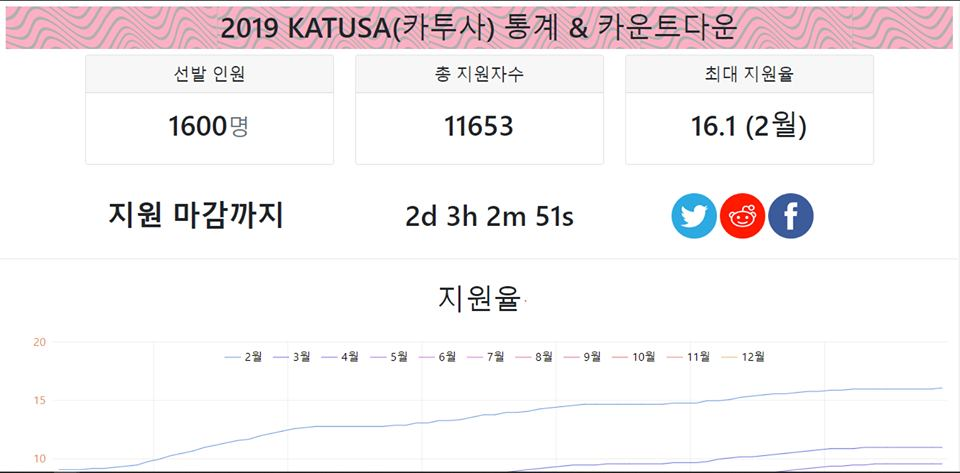
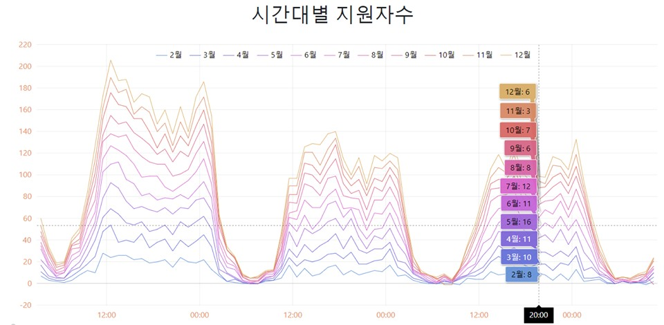

# KatusaMonitor

Website providing a competition-rates with graphs, to help applicants for KATUSA to easily monitor the data of interest, without having to visit an old &amp; complicated official government website

# Date
Created on September 22nd.

# Statistics
During a short application period(September 22th ~ November 8th):
- Gained 6282 Views, with total of 2596 Users, 870 of whom came through Organic Search
- (Website landed on the first page on Google-search with keywords in Korean: ex.“2020 카투사”).
- With 25.3[%] of Returning Users(657). And an average audience retention time of 4 minutes.

Gained a traction between users on an online forum for KATUSA.
Considering that only 1600 applicants were admitted to the program, 2600 visiting users were significant.

# Files / Description
1. BackEnd
Created a Backend-Server script in Python that automatically scraped Applicants statistics data(JSON) from the official website each minute, saved the data using MySQL and updated the main website data each hour.

"/Backend_scraper/updater.py"
- MAIN script that gets called every minute, by including it in 'crontab'.
Ex) Type 'crontab -e' in Terminal, then add: '* * * * * python {Project_directory}/Backend_scraper/updater.py'.
- This script calls 'updater_init' if needed(when hard reset is needed, like data.csv is not present, etc.)

"/Backend_scraper/updater_init.py"
- You don't directly use this script.

2. FrontEnd(Webpage)
Created a Frontend Web Application in HTML and Javascript, using ‘amCharts’ graph library, to provide all the useful infromation for applicants. Like countdown-clock until  , competition-rate for each Month entry, applicants per hour.
- Used AM4Charts graphing-utility.
- Parses Data.csv from it's directory(that is uploaded via Git push- from updater.py).
- Shows timer / statistics / etc.

# Some caviats
This project was originally named: "KatuSatu", and that is in the python function calls as well.
So erros might occur if the project name gets changed.